# Frontend Mentor - Blogr landing page

The project was based on the challenge provided by [Frontend Mentor](https://www.frontendmentor.io).

This is a solution to the [Blogr landing page challenge on Frontend Mentor](https://www.frontendmentor.io/challenges/blogr-landing-page-EX2RLAApP). 

## The design provided

---

## Table of contents

- [User Stories](#user-stories)
- [Features](#features)
- [Technologies Used](#technologies-used)
- [Design](#design)
- [Bugs](#bugs)
- [Testing](#testing)
  - [Compatibility](#compatibility)
  - [Validator testing](#validator-testing)
  - [Lighthouse Report](#lighthouse-report)
- [Deployment](#deployment)
- [Author](#author)
- [Credits](#credits)
- [Acknowledgments](#acknowledgments)

---

similar as possible to the provided images.

I have also added various breakpoints in order to provide the best user experience.

The solution to this challenge can be accessed by this [link](https://iuliiakonovalova.github.io/frontend_mentor_blogr_landing_page_main/)

---
## User Stories

### First Time Visitor Goals:

* As a First Time Visitor, I want to easily understand the main purpose of the website, so I can learn more about this website.
* As a First Time Visitor, I want to be able to easily navigate through the website, so I can find the content.
* As a First Time Visitor, I want to find the website useful.
* As a First Time Visitor, I want to see the social media links, so I can see whether the organization is trustworthy.

### Returning Visitor Goals:

* As a Returning Visitor, I want to see various content, so that I can pick the service.
* As a Returning Visitor, I want to find a way to get in contact with the organization, so that I can ask additional questions or send a request about a their service.
* As a Returning Visitor, I want to find community links, so that I can learn more about the organization.

### Frequent Visitor Goals:
* As a Frequent User, I want to be able always access the website, so I can learn about possible changes.
* As a Frequent User, I want to have various content, so I can be engage in visiting this website often.

---

## Features

### Main Page

  - Represent: 

    * the landing page for the Blogr agency.
    
    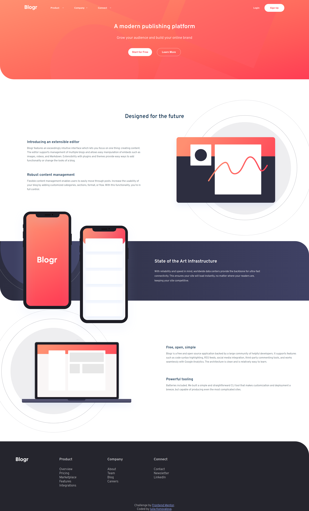

 - Consist:

    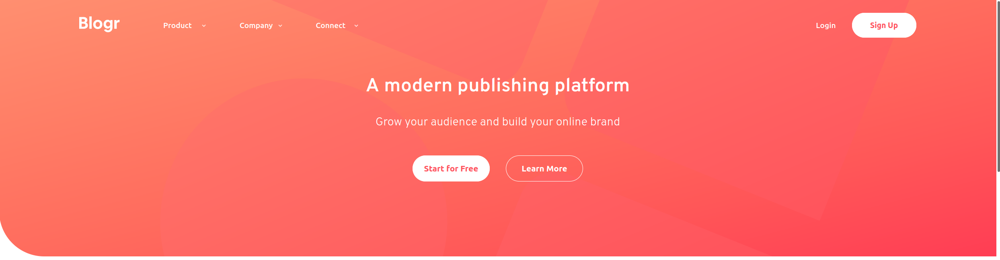 with:
### Navbar
      

The navbar has:

  1. logo in the left top corner

  

  2. Main menu with submenu as well after the logo and to buttons "Login" and "Sign Up on the right side of the screen.

  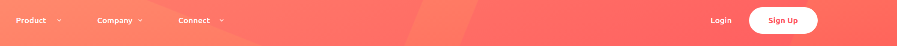

  For mobile screens menu is hidden and the user may see a hamburger icon to click on to see the whole menu:

  

  

  The submenu on the mobile devices opens down in the main container.

  

---
## Design

- The color scheme and font-family were provided by [Frontend Mentor](https://www.frontendmentor.io).

---
## Bugs (unsolved)

Since the details and summary html elements were used to create submenu, I couldn't apply changes to the blocks of the submenu and the white background of the elements looks a bit upper on the desktop screens.

---
## Testing
### Compatibility:

+ The app was tested on the following browsers: Chrome, Firefox, Brave, Edge:

  - Chrome:

  
  
  - Firefox:

  

  - Brave:

  

+ The app was checked by devtools implemented on Firefox and Chrome browsers.

### Responsiveness:

+ The app was checked with [Responsive Website Design Tester](https://responsivedesignchecker.com/).

  1. Mobile Screens:

    - Mobile 320x480, 320x568, 360x640, 375x667, 384x640, 411x731, 414x736:

     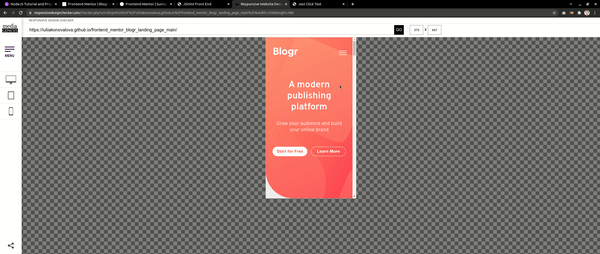

      
  1. Tablets Screens:

    - Tablet 600x960, 768x1024, 800x1280, 1366x1024, 1600x900, 1680x1050, 1920x1080, 1920x1200:
        
    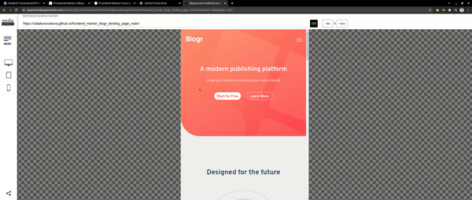
      
  1. Desktop Screens:

    - Desktop 1024x600, 1024x800, 1366x768, 1440x900:
        
    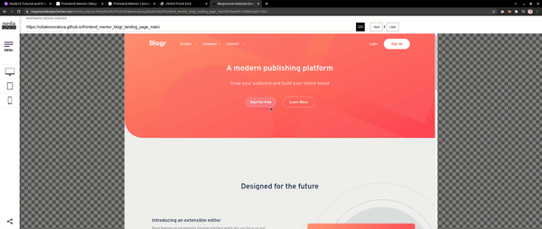

+ Functionality:

The functionality of the links in the app was checked as well by different users.

 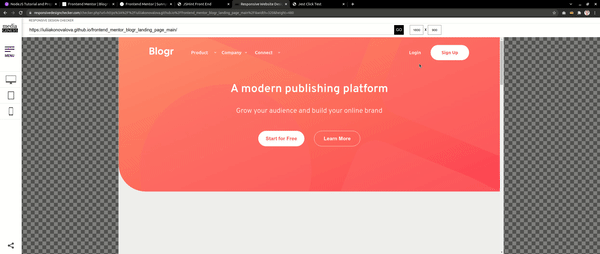

### Validator testing
+ #### HTML
  
  - No errors or warnings were found when passing through the official [W3C](https://validator.w3.org/) validator.
  
    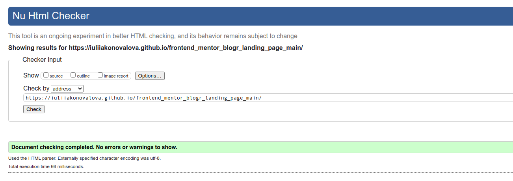
+ #### CSS
  
  - No errors or warnings were found when passing through the official [W3C (Jigsaw)](https://jigsaw.w3.org/css-validator/#validate_by_uri) validator except the following warnings regardless root: 

    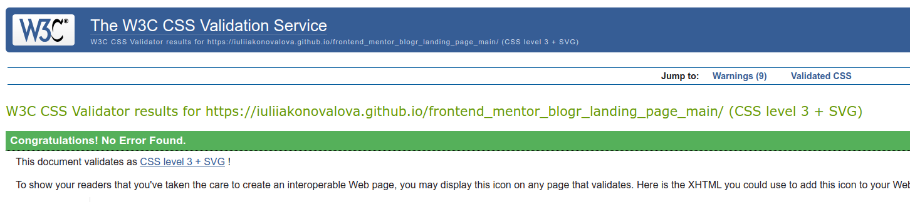

    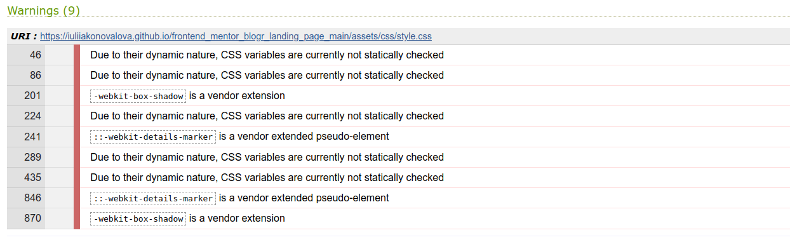

### Lighthouse Report

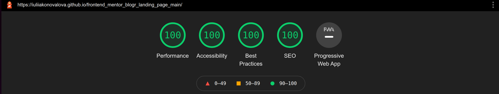